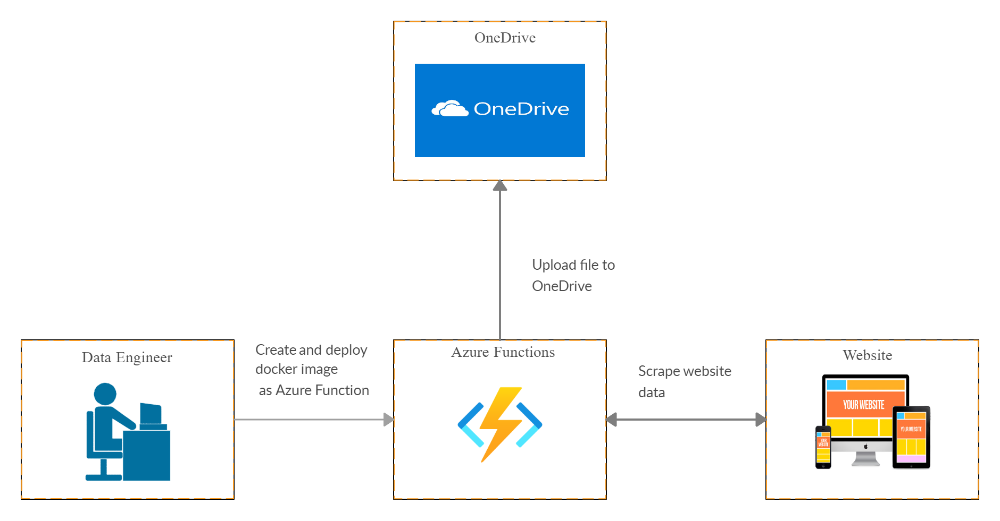
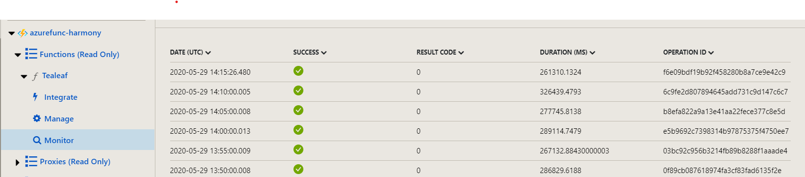
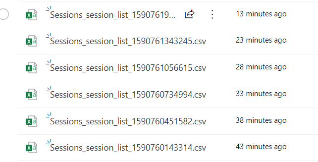

# Web Scraping with Containerized Python and Selenium in Azure Functions

## Introduction
In this project, we will be using Selenium to automate downloading of CSV files from a website and uploading of files to a OneDrive folder. We will create this in a Docker image and deploy it in Azure Functions.

## Project Files
- Scraper/__init__.py: Python files that contais the code that scrapes Tealeaf website and uploads the file to OneDrive. This is time-triggered.
 Scraper/function.
 - function.json: Configuration file for Azure Functions, here we set the trigger to be every 5 minutes.
 - DockerFile: Contains the commands to create the custom Docker image

## Steps Involved
Since the base Azure Function image does not contain the packages that we need (chromium, selenium web driver, msal), we will have to create a custom docker image with the required libraries. This will then be deployed in Azure Container Registry. Here is a diagram of the data pipeline.




Let's break this down into major steps
- Prerequisites
- Create docker image
- Create Azure Function and deploy docker image into ACR.

## Prerequisites
- Install Azure CLI - Command-line interface for Azure
- Docker - Create custom container
- Azure App Registration - Register the app to delegate access
- DockerFile - Orchestrate the building of docker image

    Encode credentials in DockerFile (make sure not to commit this, or include it in `.gitignore`)
    ```
    ENV username="" # Tealeaf/Microsoft username
    ENV password="" # Tealeaf password
    ENV password_m="" # Microsoft password
    ENV client_id="" # Application ID from App Registrations
    ENV client_secret="" # Application secret
    ```

## Create Docker Image
We will have to run the following commands, this step installs chromium, chrome driver, and all the necessary libraries.

```
# Set container registry
$acr = "<acr name>.azurecr.io"

# Build docker image using DockerFile
$ docker login $acr -u <username>
$ docker build --tag $acr/selenium .

# Push docker image to ACR (Azure Container Registry)
$ docker push $acr/selenium:latest
```

## Create Azure Function and Deploy Docker Image into ACR
We will be setting some variables needed to run the commands, we will re-use `$acr`.

```
# Setting Variables
$plan = "<Azure Function Plan>"
$rg = "<Resource Group Name>"
$loc = "<Location>"
$storage = "<Storage Account Name>"
$function = "<Azure Function Name>"

# Create resource group, storage account, and app service plan
$ az group create
$ az storage account create -n $storage -g $rg --sku Standard_LRS
$ az appservice plan create -n $plan -g $rg --sku P1v2 --is-linux

# Create Azure Function and using the docker image we pushed to ACR
$ az functionapp create -g $rg --os-type Linux --plan $plan --deployment-container $acr/selenium:latest -n $function --storage-account $storage
```

## Check in Azure Functions
In [Azure Portal](https://portal.azure.com/), we can see that our function app is running.



Checking the target OneDrive folder, we can see that the files have been uploaded every 5 minutes.

